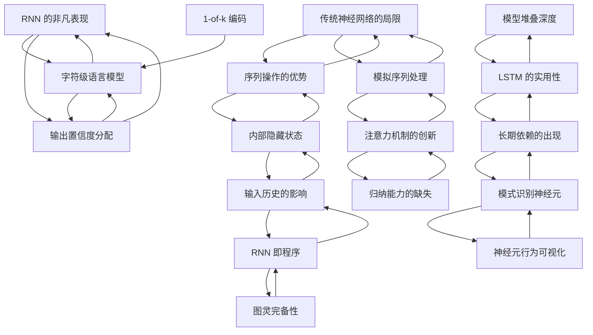

# The Unreasonable Effectiveness of Recurrent Neural Networks

[TOC]

## 🎯 核心论点 (Core Argument)
RNNs represent a fundamental paradigm shift in neural networks because they allow for operating over sequences of vectors (variable length), moving beyond the fixed-size constraints of traditional Vanilla Neural Networks. Even with simple structures, they display "magical" effectiveness in modeling language and patterns.

## 🗂️ Zettel Cards

- [[Z1-RNN 的非凡表现]]
- [[Z2-传统神经网络的局限]]
- [[Z3-序列操作的优势]]
- [[Z4-图灵完备性]]
- [[Z5-RNN 即程序]]
- [[Z6-模拟序列处理]]
- [[Z7-内部隐藏状态]]
- [[Z8-输入历史的影响]]
- [[Z9-模型堆叠深度]]
- [[Z10-LSTM 的实用性]]
- [[Z11-字符级语言模型]]
- [[Z12-1-of-k 编码]]
- [[Z13-输出置信度分配]]
- [[Z14-长期依赖的出现]]
- [[Z15-神经元行为可视化]]
- [[Z16-模式识别神经元]]
- [[Z17-注意力机制的创新]]
- [[Z18-归纳能力的缺失]]

## 🕸️ Concept Graph

## 🛠️ Gear Coaching Notes

### Gear A — 序列化處理是通用計算的基礎
Q-A1: 這個「將 RNN 視為程式 (Programs)」的視角，與您目前研究中哪一個既有的 Connection (例如認知科學或語言處理中的計算模型) 最為相關？
✍️ **Your elaboration:** 此想法屬於認知科學的世界觀，只是Karpathy所稱的“Progrmas"是指軟體工程的code package？還是人類心智的部分模組？

Q-A2: 如果 RNN 具備圖靈完備性，這對於我們理解神經網絡在處理不規則序列（相較於固定維度的傳統網絡）上有什麼具體的理論啟發？
✍️ **Your elaboration:** 所謂"Turning Completion"是不是指RNN用其Program能力，模擬學習對象的輸入與輸出？

### Gear B — 複雜語義的習得遵循從局部到整體的「湧現」規律
Q-B1: Karpathy 觀察到模型從「學會拼寫」到「湧現長距離主題」，這種層次化的湧現現象，是否可以連結到人類學習或認知發展中的階段特徵？
✍️ **Your elaboration:** 這是人類幼兒學習語言的常見現象，在人類有學習能力的生命週期裡，學習新能力都會有從基本到創作的長程現象。

Q-B2: 您認為這種「依賴深度與時間累積」的湧現，與其他探討架構擴展（Scaling）的文獻之間，有什麼潛在的跨論文關聯或張力？
✍️ **Your elaboration:** RNN所累積的模擬Program會不斷複雜化及增量，造成儲存及運算架構的挑戰，形成Scaling的課題。

### Gear C — 神經網絡具備自發的結構化特徵提取能力
Q-C1: 內部神經元能自發演化出「括號配對」等邏輯監控能力，這個發現如何改變您對「神經網絡是否只是單純統計擬合」的傳統認知？
✍️ **Your elaboration:** 此類似人類的語言能力發展到有自我創造的程度，能將文法符號廣泛運用的能力，像是動詞或名詞的屈折變化。

Q-C2: 這種隱式學會結構特徵的能力，未來可以如何應用在您關注的領域（例如自動標註、語義提取或知識圖譜）中？
✍️ **Your elaboration:** RNN能在人類不特別指示的狀況下，學會人類會關注的文本或圖像線索特徵，以強調化的特徵組織新輸入的資訊。

## ⚙️ Final Connection Gears (Phase 4)

### Gear A: RNNs as Cognitive Programs and Turing Simulators
Karpathy frames Recurrent Neural Networks as programs capable of Turing completion. These networks simulate the inputs and outputs of the learned objects. This perspective raises a question in cognitive science. It remains unclear whether these "programs" function like software code packages or model specific modules of the human mind.

### Gear B: Hierarchical Emergence and the Scaling Challenge
Recurrent Neural Networks learn from basic spelling patterns to long-distance thematic structures. This hierarchical emergence mirrors the developmental stages of human language acquisition. Humans exhibit similar long-term trajectories from basic skill acquisition to creative generation. The accumulation of simulated programs within the network continuously increases in complexity. This growth presents significant challenges for storage and computational architecture. These challenges directly shape the fundamental problems of model scaling.

### Gear C: Spontaneous Structural Extraction and Generative Capacity
Internal neurons in Recurrent Neural Networks spontaneously develop the ability to monitor logical structures. The models learn to track matching brackets without explicit human instruction. This capability resembles advanced human language development. Humans demonstrate similar creative generalization through morphological inflection. The networks learn to identify specific structural features in text or images. The models then use these emphasized features to organize new input information.
