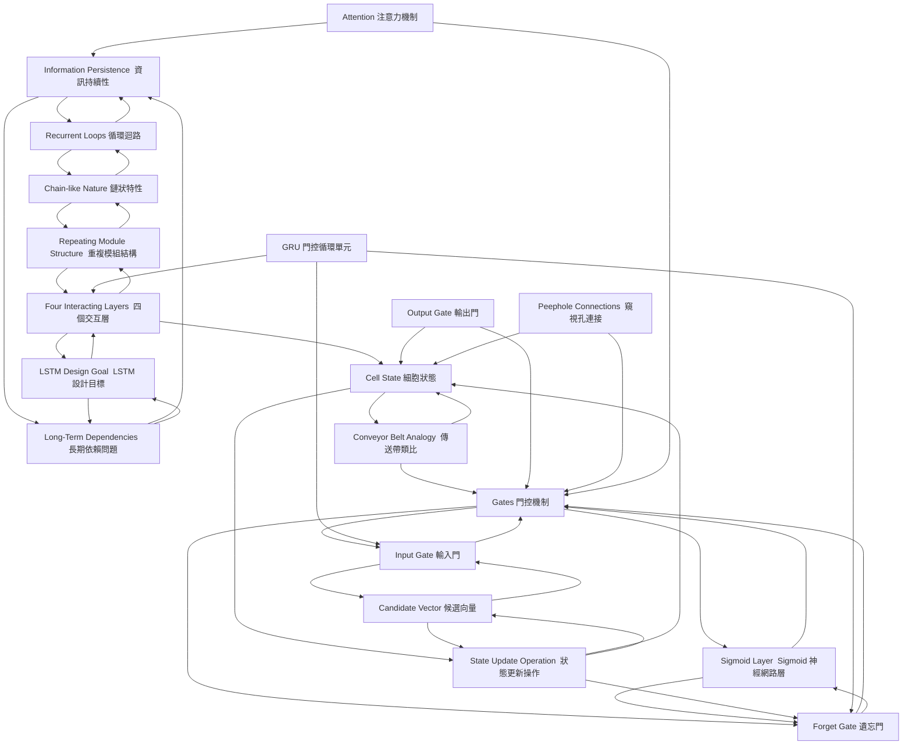

# Understanding LSTM Networks

[TOC]

## 🎯 核心论点 (Core Argument)
RNNs struggle with long-term dependencies, but LSTMs solve this inherently. Through a repeating module with four interacting layers (gates) and a conveyor-belt-like cell state, LSTMs precisely control the flow of information—deciding what to forget, what to add, and what to output—enabling them to effectively learn long-range connections.

## 🗂️ Zettel Cards
![[📚 卡片清單]]

- [[Z1-Information Persistence  資訊持續性]]
- [[Z2-Recurrent Loops  循環迴路]]
- [[Z3-Chain-like Nature  鏈狀特性]]
- [[Z4-Long-Term Dependencies  長期依賴問題]]
- [[Z5-LSTM Design Goal  LSTM 設計目標]]
- [[Z6-Repeating Module Structure  重複模組結構]]
- [[Z7-Four Interacting Layers  四個交互層]]
- [[Z8-Cell State  細胞狀態]]
- [[Z9-Conveyor Belt Analogy  傳送帶類比]]
- [[Z10-Gates  門控機制]]
- [[Z11-Sigmoid Layer  Sigmoid 神經網路層]]
- [[Z12-Forget Gate  遺忘門]]
- [[Z13-Input Gate  輸入門]]
- [[Z14-Candidate Vector  候選向量]]
- [[Z15-State Update Operation  狀態更新操作]]
- [[Z16-Output Gate  輸出門]]
- [[Z17-Peephole Connections  窺視孔連接]]
- [[Z18-GRU  門控循環單元]]
- [[Z19-Attention  注意力機制]]

## 🕸️ Concept Graph

