[Source pdf](https://karpathy.github.io/2015/05/21/rnn-effectiveness/)

# 📚 卡片清單

### 1. [循環神經網路的非凡有效性（The Unreasonable Effectiveness of RNNs）](cards/karpathy_github_io_2015_05_21_rnn-effect-001.md)
- **ID**: `karpathy_github_io_2015_05_21_rnn-effect-001`
- **核心**: "There’s something magical about Recurrent Neural Networks (RNNs)."

### 2. [RNNs處理圖像描述任務的初期成功](cards/karpathy_github_io_2015_05_21_rnn-effect-002.md)
- **ID**: `karpathy_github_io_2015_05_21_rnn-effect-002`
- **核心**: "Within a few dozen minutes of training my first baby model (with rather arbitrarily-chosen hyperparameters) started to generate very nice looking descriptions of images that were on the edge of making sense."

### 3. [推翻「RNNs難以訓練」的傳統觀念](cards/karpathy_github_io_2015_05_21_rnn-effect-003.md)
- **ID**: `karpathy_github_io_2015_05_21_rnn-effect-003`
- **核心**: "What made this result so shocking at the time was that the common wisdom was that RNNs were supposed to be difficult to train (with more experience I’ve in fact reached the opposite conclusion)."

### 4. [循環網路的序列處理能力](cards/karpathy_github_io_2015_05_21_rnn-effect-004.md)
- **ID**: `karpathy_github_io_2015_05_21_rnn-effect-004`
- **核心**: "The core reason that recurrent nets are more exciting is that they allow us to operate over sequences of vectors: Sequences in the input, the output, or in the most general case both."

### 5. [傳統神經網路的固定輸入輸出限制](cards/karpathy_github_io_2015_05_21_rnn-effect-005.md)
- **ID**: `karpathy_github_io_2015_05_21_rnn-effect-005`
- **核心**: "A glaring limitation of Vanilla Neural Networks (and also Convolutional Networks) is that their API is too constrained: they accept a fixed-sized vector as input (e.g. an image) and produce a fixed-sized vector as output (e.g. probabilities of different classes)."

### 6. [RNNs作為可程式化系統](cards/karpathy_github_io_2015_05_21_rnn-effect-006.md)
- **ID**: `karpathy_github_io_2015_05_21_rnn-effect-006`
- **核心**: "Viewed this way, RNNs essentially describe programs. In fact, it is known that RNNs are Turing-Complete in the sense that they can to simulate arbitrary programs (with proper weights)."

### 7. [訓練循環網路是程式的優化](cards/karpathy_github_io_2015_05_21_rnn-effect-007.md)
- **ID**: `karpathy_github_io_2015_05_21_rnn-effect-007`
- **核心**: "If training vanilla neural nets is optimization over functions, training recurrent nets is optimization over programs."

### 8. [在缺乏序列數據時進行序列處理](cards/karpathy_github_io_2015_05_21_rnn-effect-008.md)
- **ID**: `karpathy_github_io_2015_05_21_rnn-effect-008`
- **核心**: "The takeaway is that even if your data is not in form of sequences, you can still formulate and train powerful models that learn to process it sequentially."

### 9. [RNN的核心API與`step`函數](cards/karpathy_github_io_2015_05_21_rnn-effect-009.md)
- **ID**: `karpathy_github_io_2015_05_21_rnn-effect-009`
- **核心**: "At the core, RNNs have a deceptively simple API: They accept an input vector x and give you an output vector y. However, crucially this output vector’s contents are influenced not only by the input you just fed in, but also on the entire history of inputs you’ve fed in in the past. Written as a class, the RNN’s API consists of a single step function: `y = rnn.step(x)`"

### 10. [Vanilla RNN的隱藏狀態更新機制](cards/karpathy_github_io_2015_05_21_rnn-effect-010.md)
- **ID**: `karpathy_github_io_2015_05_21_rnn-effect-010`
- **核心**: "Here is an implementation of the step function in a Vanilla RNN: `self.h = np.tanh(np.dot(self.W_hh, self.h) + np.dot(self.W_xh, x))`"

### 11. [Vanilla RNN的模型參數](cards/karpathy_github_io_2015_05_21_rnn-effect-011.md)
- **ID**: `karpathy_github_io_2015_05_21_rnn-effect-011`
- **核心**: "This RNN’s parameters are the three matrices W_hh, W_xh, W_hy."

### 12. [RNN訓練的目標：尋找最佳權重矩陣](cards/karpathy_github_io_2015_05_21_rnn-effect-012.md)
- **ID**: `karpathy_github_io_2015_05_21_rnn-effect-012`
- **核心**: "We initialize the matrices of the RNN with random numbers and the bulk of work during training goes into finding the matrices that give rise to desirable behavior, as measured with some loss function that expresses your preference to what kinds of outputs y you’d like to see in response to your input sequences x."

### 13. [深度循環網路：堆疊模型以提升性能](cards/karpathy_github_io_2015_05_21_rnn-effect-013.md)
- **ID**: `karpathy_github_io_2015_05_21_rnn-effect-013`
- **核心**: "RNNs are neural networks and everything works monotonically better (if done right) if you put on your deep learning hat and start stacking models up like pancakes."

### 14. [長短期記憶網路（LSTM）的實用優勢](cards/karpathy_github_io_2015_05_21_rnn-effect-014.md)
- **ID**: `karpathy_github_io_2015_05_21_rnn-effect-014`
- **核心**: "I’d like to briefly mention that in practice most of us use a slightly different formulation than what I presented above called a Long Short-Term Memory (LSTM) network. The LSTM is a particular type of recurrent network that works slightly better in practice, owing to its more powerful update equation and some appealing backpropagation dynamics."

### 15. [字符級語言模型（Character-Level Language Models）](cards/karpathy_github_io_2015_05_21_rnn-effect-015.md)
- **ID**: `karpathy_github_io_2015_05_21_rnn-effect-015`
- **核心**: "That is, we’ll give the RNN a huge chunk of text and ask it to model the probability distribution of the next character in the sequence given a sequence of previous characters. This will then allow us to generate new text one character at a time."

### 16. [字符的1-of-k編碼](cards/karpathy_github_io_2015_05_21_rnn-effect-016.md)
- **ID**: `karpathy_github_io_2015_05_21_rnn-effect-016`
- **核心**: "Concretely, we will encode each character into a vector using 1-of-k encoding (i.e. all zero except for a single one at the index of the character in the vocabulary), and feed them into the RNN one at a time with the step function."

### 17. [RNN輸出向量作為下一個字符置信度](cards/karpathy_github_io_2015_05_21_rnn-effect-017.md)
- **ID**: `karpathy_github_io_2015_05_21_rnn-effect-017`
- **核心**: "We will then observe a sequence of 4-dimensional output vectors (one dimension per character), which we interpret as the confidence the RNN currently assigns to each character coming next in the sequence."

### 18. [Softmax分類器與交叉熵損失](cards/karpathy_github_io_2015_05_21_rnn-effect-018.md)
- **ID**: `karpathy_github_io_2015_05_21_rnn-effect-018`
- **核心**: "A more technical explanation is that we use the standard Softmax classifier (also commonly referred to as the cross-entropy loss) on every output vector simultaneously."

### 19. [採用迷你批次隨機梯度下降與自適應學習率方法](cards/karpathy_github_io_2015_05_21_rnn-effect-019.md)
- **ID**: `karpathy_github_io_2015_05_21_rnn-effect-019`
- **核心**: "The RNN is trained with mini-batch Stochastic Gradient Descent and I like to use RMSProp or Adam (per-parameter adaptive learning rate methods) to stablilize the updates."

### 20. [RNN透過循環連接追蹤上下文](cards/karpathy_github_io_2015_05_21_rnn-effect-020.md)
- **ID**: `karpathy_github_io_2015_05_21_rnn-effect-020`
- **核心**: "The RNN therefore cannot rely on the input alone and must use its recurrent connection to keep track of the context to achieve this task."

### 21. [測試時透過採樣生成文本](cards/karpathy_github_io_2015_05_21_rnn-effect-021.md)
- **ID**: `karpathy_github_io_2015_05_21_rnn-effect-021`
- **核心**: "At test time, we feed a character into the RNN and get a distribution over what characters are likely to come next. We sample from this distribution, and feed it right back in to get the next letter. Repeat this process and you’re sampling text!"

### 22. [Paul Graham文章生成器](cards/karpathy_github_io_2015_05_21_rnn-effect-022.md)
- **ID**: `karpathy_github_io_2015_05_21_rnn-effect-022`
- **核心**: "Okay, clearly the above is unfortunately not going to replace Paul Graham anytime soon, but remember that the RNN had to learn English completely from scratch and with a small dataset (including where you put commas, apostrophes and spaces)."

### 23. [採樣溫度（Temperature）對文本生成的影響](cards/karpathy_github_io_2015_05_21_rnn-effect-023.md)
- **ID**: `karpathy_github_io_2015_05_21_rnn-effect-023`
- **核心**: "Decreasing the temperature from 1 to some lower number (e.g. 0.5) makes the RNN more confident, but also more conservative in its samples. Conversely, higher temperatures will give more diversity but at cost of more mistakes (e.g. spelling mistakes, etc)."

### 24. [Shakespeare作品生成器](cards/karpathy_github_io_2015_05_21_rnn-effect-024.md)
- **ID**: `karpathy_github_io_2015_05_21_rnn-effect-024`
- **核心**: "I can barely recognize these samples from actual Shakespeare :) If you like Shakespeare, you might appreciate this 100,000 character sample."

### 25. [維基百科文章生成器與結構化文本學習](cards/karpathy_github_io_2015_05_21_rnn-effect-025.md)
- **ID**: `karpathy_github_io_2015_05_21_rnn-effect-025`
- **核心**: "The takeaway is that even if your data is not in form of sequences, you can still formulate and train powerful models that learn to process it sequentially."

### 26. [代數幾何LaTeX生成器](cards/karpathy_github_io_2015_05_21_rnn-effect-026.md)
- **ID**: `karpathy_github_io_2015_05_21_rnn-effect-026`
- **核心**: "Amazingly, the resulting sampled Latex almost compiles. We had to step in and fix a few issues manually but then you get plausible looking math, it’s quite astonishing."

### 27. [RNN在處理複雜結構時的長期依賴錯誤](cards/karpathy_github_io_2015_05_21_rnn-effect-027.md)
- **ID**: `karpathy_github_io_2015_05_21_rnn-effect-027`
- **核心**: "For example, the model opens a `\begin{proof}` environment but then ends it with a `\end{lemma}`. This is an example of a problem we’d have to fix manually, and is likely due to the fact that the dependency is too long-term: By the time the model is done with the proof it has forgotten whether it was doing a proof or a lemma."

### 28. [Linux源代碼生成器](cards/karpathy_github_io_2015_05_21_rnn-effect-028.md)
- **ID**: `karpathy_github_io_2015_05_21_rnn-effect-028`
- **核心**: "The code looks really quite great overall. Of course, I don’t think it compiles but when you scroll through the generate code it feels very much like a giant C code base."

### 29. [源代碼生成模式：版權聲明、引入和宏](cards/karpathy_github_io_2015_05_21_rnn-effect-029.md)
- **ID**: `karpathy_github_io_2015_05_21_rnn-effect-029`
- **核心**: "The model first recites the GNU license character by character, samples a few includes, generates some macros and then dives into the code:"

### 30. [嬰兒姓名生成器](cards/karpathy_github_io_2015_05_21_rnn-effect-030.md)
- **ID**: `karpathy_github_io_2015_05_21_rnn-effect-030`
- **核心**: "Lets feed the RNN a large text file that contains 8000 baby names listed out, one per line (names obtained from here). We can feed this to the RNN and then generate new names!"

# 🗺️ 概念網絡圖

```mermaid
graph TD

    karpathy_github_io_2015_05_21_rnn-effect-001["循環神經網路的非凡有效性（The Unreasonable Effectiveness of RNNs）"]

    karpathy_github_io_2015_05_21_rnn-effect-002["RNNs處理圖像描述任務的初期成功"]

    karpathy_github_io_2015_05_21_rnn-effect-003["推翻「RNNs難以訓練」的傳統觀念"]

    karpathy_github_io_2015_05_21_rnn-effect-004["循環網路的序列處理能力"]

    karpathy_github_io_2015_05_21_rnn-effect-005["傳統神經網路的固定輸入輸出限制"]

    karpathy_github_io_2015_05_21_rnn-effect-006["RNNs作為可程式化系統"]

    karpathy_github_io_2015_05_21_rnn-effect-007["訓練循環網路是程式的優化"]

    karpathy_github_io_2015_05_21_rnn-effect-008["在缺乏序列數據時進行序列處理"]

    karpathy_github_io_2015_05_21_rnn-effect-009["RNN的核心API與`step`函數"]

    karpathy_github_io_2015_05_21_rnn-effect-010["Vanilla RNN的隱藏狀態更新機制"]

    karpathy_github_io_2015_05_21_rnn-effect-011["Vanilla RNN的模型參數"]

    karpathy_github_io_2015_05_21_rnn-effect-012["RNN訓練的目標：尋找最佳權重矩陣"]

    karpathy_github_io_2015_05_21_rnn-effect-013["深度循環網路：堆疊模型以提升性能"]

    karpathy_github_io_2015_05_21_rnn-effect-014["長短期記憶網路（LSTM）的實用優勢"]

    karpathy_github_io_2015_05_21_rnn-effect-015["字符級語言模型（Character-Level Language Models）"]

    karpathy_github_io_2015_05_21_rnn-effect-016["字符的1-of-k編碼"]

    karpathy_github_io_2015_05_21_rnn-effect-017["RNN輸出向量作為下一個字符置信度"]

    karpathy_github_io_2015_05_21_rnn-effect-018["Softmax分類器與交叉熵損失"]

    karpathy_github_io_2015_05_21_rnn-effect-019["採用迷你批次隨機梯度下降與自適應學習率方法"]

    karpathy_github_io_2015_05_21_rnn-effect-020["RNN透過循環連接追蹤上下文"]

    karpathy_github_io_2015_05_21_rnn-effect-021["測試時透過採樣生成文本"]

    karpathy_github_io_2015_05_21_rnn-effect-022["Paul Graham文章生成器"]

    karpathy_github_io_2015_05_21_rnn-effect-023["採樣溫度（Temperature）對文本生成的影響"]

    karpathy_github_io_2015_05_21_rnn-effect-024["Shakespeare作品生成器"]

    karpathy_github_io_2015_05_21_rnn-effect-025["維基百科文章生成器與結構化文本學習"]

    karpathy_github_io_2015_05_21_rnn-effect-026["代數幾何LaTeX生成器"]

    karpathy_github_io_2015_05_21_rnn-effect-027["RNN在處理複雜結構時的長期依賴錯誤"]

    karpathy_github_io_2015_05_21_rnn-effect-028["Linux源代碼生成器"]

    karpathy_github_io_2015_05_21_rnn-effect-029["源代碼生成模式：版權聲明、引入和宏"]

    karpathy_github_io_2015_05_21_rnn-effect-030["嬰兒姓名生成器"]






    karpathy_github_io_2015_05_21_rnn-effect-001 --> karpathy_github_io_2015_05_21_rnn-effect-002

    karpathy_github_io_2015_05_21_rnn-effect-001 --> karpathy_github_io_2015_05_21_rnn-effect-003






    karpathy_github_io_2015_05_21_rnn-effect-001 --> karpathy_github_io_2015_05_21_rnn-effect-002




    karpathy_github_io_2015_05_21_rnn-effect-002 --> karpathy_github_io_2015_05_21_rnn-effect-003

    karpathy_github_io_2015_05_21_rnn-effect-002 --> karpathy_github_io_2015_05_21_rnn-effect-004






    karpathy_github_io_2015_05_21_rnn-effect-001 --> karpathy_github_io_2015_05_21_rnn-effect-003

    karpathy_github_io_2015_05_21_rnn-effect-002 --> karpathy_github_io_2015_05_21_rnn-effect-003




    karpathy_github_io_2015_05_21_rnn-effect-003 --> karpathy_github_io_2015_05_21_rnn-effect-004

    karpathy_github_io_2015_05_21_rnn-effect-003 --> karpathy_github_io_2015_05_21_rnn-effect-014






    karpathy_github_io_2015_05_21_rnn-effect-001 --> karpathy_github_io_2015_05_21_rnn-effect-004

    karpathy_github_io_2015_05_21_rnn-effect-003 --> karpathy_github_io_2015_05_21_rnn-effect-004




    karpathy_github_io_2015_05_21_rnn-effect-004 --> karpathy_github_io_2015_05_21_rnn-effect-005

    karpathy_github_io_2015_05_21_rnn-effect-004 --> karpathy_github_io_2015_05_21_rnn-effect-006






    karpathy_github_io_2015_05_21_rnn-effect-004 --> karpathy_github_io_2015_05_21_rnn-effect-005







    karpathy_github_io_2015_05_21_rnn-effect-004 --> karpathy_github_io_2015_05_21_rnn-effect-006




    karpathy_github_io_2015_05_21_rnn-effect-006 --> karpathy_github_io_2015_05_21_rnn-effect-007




    karpathy_github_io_2015_05_21_rnn-effect-006 -.-> karpathy_github_io_2015_05_21_rnn-effect-009





    karpathy_github_io_2015_05_21_rnn-effect-006 --> karpathy_github_io_2015_05_21_rnn-effect-007







    karpathy_github_io_2015_05_21_rnn-effect-004 --> karpathy_github_io_2015_05_21_rnn-effect-008




    karpathy_github_io_2015_05_21_rnn-effect-008 --> karpathy_github_io_2015_05_21_rnn-effect-009




    karpathy_github_io_2015_05_21_rnn-effect-008 -.-> karpathy_github_io_2015_05_21_rnn-effect-025





    karpathy_github_io_2015_05_21_rnn-effect-004 --> karpathy_github_io_2015_05_21_rnn-effect-009

    karpathy_github_io_2015_05_21_rnn-effect-008 --> karpathy_github_io_2015_05_21_rnn-effect-009




    karpathy_github_io_2015_05_21_rnn-effect-009 --> karpathy_github_io_2015_05_21_rnn-effect-010




    karpathy_github_io_2015_05_21_rnn-effect-009 -.-> karpathy_github_io_2015_05_21_rnn-effect-006





    karpathy_github_io_2015_05_21_rnn-effect-009 --> karpathy_github_io_2015_05_21_rnn-effect-010




    karpathy_github_io_2015_05_21_rnn-effect-010 --> karpathy_github_io_2015_05_21_rnn-effect-011

    karpathy_github_io_2015_05_21_rnn-effect-010 --> karpathy_github_io_2015_05_21_rnn-effect-012






    karpathy_github_io_2015_05_21_rnn-effect-010 --> karpathy_github_io_2015_05_21_rnn-effect-011




    karpathy_github_io_2015_05_21_rnn-effect-011 --> karpathy_github_io_2015_05_21_rnn-effect-012




    karpathy_github_io_2015_05_21_rnn-effect-011 -.-> karpathy_github_io_2015_05_21_rnn-effect-019





    karpathy_github_io_2015_05_21_rnn-effect-011 --> karpathy_github_io_2015_05_21_rnn-effect-012




    karpathy_github_io_2015_05_21_rnn-effect-012 --> karpathy_github_io_2015_05_21_rnn-effect-018

    karpathy_github_io_2015_05_21_rnn-effect-012 --> karpathy_github_io_2015_05_21_rnn-effect-019




    karpathy_github_io_2015_05_21_rnn-effect-012 -.-> karpathy_github_io_2015_05_21_rnn-effect-007





    karpathy_github_io_2015_05_21_rnn-effect-009 --> karpathy_github_io_2015_05_21_rnn-effect-013




    karpathy_github_io_2015_05_21_rnn-effect-013 --> karpathy_github_io_2015_05_21_rnn-effect-014




    karpathy_github_io_2015_05_21_rnn-effect-013 -.-> karpathy_github_io_2015_05_21_rnn-effect-024





    karpathy_github_io_2015_05_21_rnn-effect-003 --> karpathy_github_io_2015_05_21_rnn-effect-014

    karpathy_github_io_2015_05_21_rnn-effect-010 --> karpathy_github_io_2015_05_21_rnn-effect-014




    karpathy_github_io_2015_05_21_rnn-effect-014 --> karpathy_github_io_2015_05_21_rnn-effect-022

    karpathy_github_io_2015_05_21_rnn-effect-014 --> karpathy_github_io_2015_05_21_rnn-effect-024






    karpathy_github_io_2015_05_21_rnn-effect-004 --> karpathy_github_io_2015_05_21_rnn-effect-015

    karpathy_github_io_2015_05_21_rnn-effect-014 --> karpathy_github_io_2015_05_21_rnn-effect-015




    karpathy_github_io_2015_05_21_rnn-effect-015 --> karpathy_github_io_2015_05_21_rnn-effect-016

    karpathy_github_io_2015_05_21_rnn-effect-015 --> karpathy_github_io_2015_05_21_rnn-effect-017




    karpathy_github_io_2015_05_21_rnn-effect-015 -.-> karpathy_github_io_2015_05_21_rnn-effect-021





    karpathy_github_io_2015_05_21_rnn-effect-015 --> karpathy_github_io_2015_05_21_rnn-effect-016




    karpathy_github_io_2015_05_21_rnn-effect-016 --> karpathy_github_io_2015_05_21_rnn-effect-017




    karpathy_github_io_2015_05_21_rnn-effect-016 -.-> karpathy_github_io_2015_05_21_rnn-effect-009





    karpathy_github_io_2015_05_21_rnn-effect-016 --> karpathy_github_io_2015_05_21_rnn-effect-017




    karpathy_github_io_2015_05_21_rnn-effect-017 --> karpathy_github_io_2015_05_21_rnn-effect-018

    karpathy_github_io_2015_05_21_rnn-effect-017 --> karpathy_github_io_2015_05_21_rnn-effect-021






    karpathy_github_io_2015_05_21_rnn-effect-017 --> karpathy_github_io_2015_05_21_rnn-effect-018

    karpathy_github_io_2015_05_21_rnn-effect-012 --> karpathy_github_io_2015_05_21_rnn-effect-018




    karpathy_github_io_2015_05_21_rnn-effect-018 --> karpathy_github_io_2015_05_21_rnn-effect-019




    karpathy_github_io_2015_05_21_rnn-effect-018 -.-> karpathy_github_io_2015_05_21_rnn-effect-023





    karpathy_github_io_2015_05_21_rnn-effect-012 --> karpathy_github_io_2015_05_21_rnn-effect-019

    karpathy_github_io_2015_05_21_rnn-effect-018 --> karpathy_github_io_2015_05_21_rnn-effect-019




    karpathy_github_io_2015_05_21_rnn-effect-019 --> karpathy_github_io_2015_05_21_rnn-effect-020




    karpathy_github_io_2015_05_21_rnn-effect-019 -.-> karpathy_github_io_2015_05_21_rnn-effect-003





    karpathy_github_io_2015_05_21_rnn-effect-004 --> karpathy_github_io_2015_05_21_rnn-effect-020

    karpathy_github_io_2015_05_21_rnn-effect-009 --> karpathy_github_io_2015_05_21_rnn-effect-020




    karpathy_github_io_2015_05_21_rnn-effect-020 --> karpathy_github_io_2015_05_21_rnn-effect-021




    karpathy_github_io_2015_05_21_rnn-effect-020 -.-> karpathy_github_io_2015_05_21_rnn-effect-014





    karpathy_github_io_2015_05_21_rnn-effect-017 --> karpathy_github_io_2015_05_21_rnn-effect-021

    karpathy_github_io_2015_05_21_rnn-effect-018 --> karpathy_github_io_2015_05_21_rnn-effect-021




    karpathy_github_io_2015_05_21_rnn-effect-021 --> karpathy_github_io_2015_05_21_rnn-effect-022

    karpathy_github_io_2015_05_21_rnn-effect-021 --> karpathy_github_io_2015_05_21_rnn-effect-023




    karpathy_github_io_2015_05_21_rnn-effect-021 -.-> karpathy_github_io_2015_05_21_rnn-effect-015





    karpathy_github_io_2015_05_21_rnn-effect-015 --> karpathy_github_io_2015_05_21_rnn-effect-022

    karpathy_github_io_2015_05_21_rnn-effect-021 --> karpathy_github_io_2015_05_21_rnn-effect-022




    karpathy_github_io_2015_05_21_rnn-effect-022 --> karpathy_github_io_2015_05_21_rnn-effect-023

    karpathy_github_io_2015_05_21_rnn-effect-022 --> karpathy_github_io_2015_05_21_rnn-effect-024




    karpathy_github_io_2015_05_21_rnn-effect-022 -.-> karpathy_github_io_2015_05_21_rnn-effect-002





    karpathy_github_io_2015_05_21_rnn-effect-021 --> karpathy_github_io_2015_05_21_rnn-effect-023




    karpathy_github_io_2015_05_21_rnn-effect-023 --> karpathy_github_io_2015_05_21_rnn-effect-022




    karpathy_github_io_2015_05_21_rnn-effect-023 -.-> karpathy_github_io_2015_05_21_rnn-effect-018





    karpathy_github_io_2015_05_21_rnn-effect-015 --> karpathy_github_io_2015_05_21_rnn-effect-024

    karpathy_github_io_2015_05_21_rnn-effect-022 --> karpathy_github_io_2015_05_21_rnn-effect-024




    karpathy_github_io_2015_05_21_rnn-effect-024 --> karpathy_github_io_2015_05_21_rnn-effect-025




    karpathy_github_io_2015_05_21_rnn-effect-024 -.-> karpathy_github_io_2015_05_21_rnn-effect-013





    karpathy_github_io_2015_05_21_rnn-effect-015 --> karpathy_github_io_2015_05_21_rnn-effect-025

    karpathy_github_io_2015_05_21_rnn-effect-024 --> karpathy_github_io_2015_05_21_rnn-effect-025




    karpathy_github_io_2015_05_21_rnn-effect-025 --> karpathy_github_io_2015_05_21_rnn-effect-026

    karpathy_github_io_2015_05_21_rnn-effect-025 --> karpathy_github_io_2015_05_21_rnn-effect-027




    karpathy_github_io_2015_05_21_rnn-effect-025 -.-> karpathy_github_io_2015_05_21_rnn-effect-008





    karpathy_github_io_2015_05_21_rnn-effect-015 --> karpathy_github_io_2015_05_21_rnn-effect-026

    karpathy_github_io_2015_05_21_rnn-effect-025 --> karpathy_github_io_2015_05_21_rnn-effect-026




    karpathy_github_io_2015_05_21_rnn-effect-026 --> karpathy_github_io_2015_05_21_rnn-effect-027




    karpathy_github_io_2015_05_21_rnn-effect-026 -.-> karpathy_github_io_2015_05_21_rnn-effect-006





    karpathy_github_io_2015_05_21_rnn-effect-026 --> karpathy_github_io_2015_05_21_rnn-effect-027




    karpathy_github_io_2015_05_21_rnn-effect-027 --> karpathy_github_io_2015_05_21_rnn-effect-028




    karpathy_github_io_2015_05_21_rnn-effect-027 -.-> karpathy_github_io_2015_05_21_rnn-effect-014





    karpathy_github_io_2015_05_21_rnn-effect-015 --> karpathy_github_io_2015_05_21_rnn-effect-028

    karpathy_github_io_2015_05_21_rnn-effect-027 --> karpathy_github_io_2015_05_21_rnn-effect-028




    karpathy_github_io_2015_05_21_rnn-effect-028 --> karpathy_github_io_2015_05_21_rnn-effect-029




    karpathy_github_io_2015_05_21_rnn-effect-028 -.-> karpathy_github_io_2015_05_21_rnn-effect-007





    karpathy_github_io_2015_05_21_rnn-effect-028 --> karpathy_github_io_2015_05_21_rnn-effect-029




    karpathy_github_io_2015_05_21_rnn-effect-029 --> karpathy_github_io_2015_05_21_rnn-effect-030




    karpathy_github_io_2015_05_21_rnn-effect-029 -.-> karpathy_github_io_2015_05_21_rnn-effect-025





    karpathy_github_io_2015_05_21_rnn-effect-015 --> karpathy_github_io_2015_05_21_rnn-effect-030

    karpathy_github_io_2015_05_21_rnn-effect-021 --> karpathy_github_io_2015_05_21_rnn-effect-030




    karpathy_github_io_2015_05_21_rnn-effect-030 --> karpathy_github_io_2015_05_21_rnn-effect-001




    karpathy_github_io_2015_05_21_rnn-effect-030 -.-> karpathy_github_io_2015_05_21_rnn-effect-022
```

# Collaborated Annotations by human brain🧠 and by AI 🤖

### 理論框架：RNN 作為通用序列處理器

Andrej以「非凡有效性」作為開場，依據並非形式證明，而是直接的實證經驗。Andrej描述在圖像描述任務中，[[karpathy_github_io_2015_05_21_rnn-effect-001.md|循環神經網路的非凡有效性]]令人印象深刻——[[karpathy_github_io_2015_05_21_rnn-effect-002.md|首個原型模型在訓練數小時後便產生頗具說服力的輸出]]，這一結果足以引發系統性探索的動機。Andrej同時明確挑戰了[[karpathy_github_io_2015_05_21_rnn-effect-003.md|「RNN 難以訓練」的既有觀念]]，並指出根據個人累積的實作經驗，此論斷實為謬誤。論述的起點是一項結構性批評：[[karpathy_github_io_2015_05_21_rnn-effect-005.md|傳統前饋神經網路受限於固定大小的輸入與輸出]]，這一限制使其無法勝任需要可變長度處理的任務。RNN 透過[[karpathy_github_io_2015_05_21_rnn-effect-004.md|序列處理能力]]克服此限制，能夠對任意長度的有序輸入進行操作。

理論框架進一步延伸至計算普遍性。Andrej將[[karpathy_github_io_2015_05_21_rnn-effect-006.md|RNN 定性為可程式化系統]]，指出其圖靈完備性（Turing-completeness）：在適當的權重配置下，循環網路能夠模擬任意可計算程式。這一框架將 RNN 訓練從函數逼近重新概念化為[[karpathy_github_io_2015_05_21_rnn-effect-007.md|程式的優化]]，強調架構的表達能力而非統計屬性。Andrej進一步論證，[[karpathy_github_io_2015_05_21_rnn-effect-008.md|即便面對非序列資料，序列處理仍能帶來優勢]]，暗示循環的歸納偏置（inductive bias）在其典型應用領域之外亦具備效益。

**→ 潛在 Gear**：將 RNN 框架為「程式」而非「函數」的圖靈完備性論述，引發了一場理論張力。這場張力在十年後的 Transformer 普遍性辯論以及情境學習（in-context learning）本質的討論中重新浮現。

### 技術架構：從最小化 API 到訓練流程

在實作層面，Andrej以刻意的極簡介面呈現 RNN：[[karpathy_github_io_2015_05_21_rnn-effect-009.md|`step` 函數]]將輸入向量映射至輸出向量，同時更新持久性隱藏狀態。Vanilla RNN 的[[karpathy_github_io_2015_05_21_rnn-effect-010.md|隱藏狀態更新]]對當前輸入與前一隱藏狀態的加權組合施加單一 tanh 非線性轉換。[[karpathy_github_io_2015_05_21_rnn-effect-011.md|三個權重矩陣]]（W_hh、W_xh、W_hy）構成全部參數化，此化約使架構在教學目的上達到最大透明度。訓練過程即為[[karpathy_github_io_2015_05_21_rnn-effect-012.md|尋找能夠最小化序列損失函數的權重矩陣]]的過程。

在字符級語言模型的訓練目標上，[[karpathy_github_io_2015_05_21_rnn-effect-018.md|Softmax 交叉熵損失]]被同步應用於所有輸出位置。優化採用[[karpathy_github_io_2015_05_21_rnn-effect-019.md|帶有自適應學習率方法的迷你批次隨機梯度下降]]（RMSProp 或 Adam）以穩定跨長距依賴的更新。Andrej指出，在正確實施的前提下，[[karpathy_github_io_2015_05_21_rnn-effect-013.md|疊加循環層能夠單調地提升性能]]；同時，[[karpathy_github_io_2015_05_21_rnn-effect-014.md|LSTM 在實際應用中優於 Vanilla RNN]]，原因在於其閘控機制以及更為有利的反向傳播動態特性。

**→ 潛在 Gear**：將 RNN 訓練化約為三個矩陣的教學性簡化，建立了一套最小充分描述，為後續架構比較提供了錨點。每一個主要的後繼架構（LSTM、GRU、Transformer）皆可被分析為對這一 API 的修改。

### 字符級語言模型作為示範載體

文章的實證示範以[[karpathy_github_io_2015_05_21_rnn-effect-015.md|字符級語言模型]]為核心，讓網路學習在給定前序字符序列的條件下預測下一個字符的概率分佈。輸入字符以[[karpathy_github_io_2015_05_21_rnn-effect-016.md|1-of-k 向量]]編碼後逐一輸入網路，每個時步的[[karpathy_github_io_2015_05_21_rnn-effect-017.md|輸出向量代表詞彙表上的概率分佈]]。在訓練期間，網路必須學習[[karpathy_github_io_2015_05_21_rnn-effect-020.md|透過循環連接維持上下文信息]]，而非僅依賴當前輸入。在[[karpathy_github_io_2015_05_21_rnn-effect-021.md|測試階段，文本透過迭代採樣生成]]——從概率分佈中採樣一個字符後，立即將其作為下一時步的輸入，重複此過程即可生成文本。

生成品質透過[[karpathy_github_io_2015_05_21_rnn-effect-023.md|採樣溫度（temperature）]]進行調控，此參數決定多樣性與準確性之間的取捨。較低溫度產生更為保守的輸出；較高溫度引入多樣性，代價則是連貫性的降低。Andrej將其呈現為實用調節手段而非理論貢獻——這是一個在大型語言模型部署中至今仍未完全解決的張力的早期表述。

**→ 潛在 Gear**：字符級表述——僅從原始位元組學習完整的語言結構，無需符號鷹架（symbolic scaffolding）——是一種刻意的方法論選擇，旨在探究純粹分佈式學習的充分性。其成功挑戰了基於分詞（tokenization）的正統觀念，並預示了數十年後位元組級語言模型的出現。

### 示範與限制：循環記憶的實證邊界

Andrej以五個生成領域作為表徵範疇廣度的佐證。訓練於[[karpathy_github_io_2015_05_21_rnn-effect-022.md|Paul Graham 散文]]上的模型產出表面風格可信、但命題連貫性在較長跨度下失效的文本。[[karpathy_github_io_2015_05_21_rnn-effect-024.md|莎士比亞模型]]生成了形式上酷似原著的詩句。訓練於[[karpathy_github_io_2015_05_21_rnn-effect-025.md|維基百科標記語言]]的模型不僅學習散文內容，同時習得文件格式的結構性慣例，顯示網路在習得內容的同時亦獲得了其句法框架。[[karpathy_github_io_2015_05_21_rnn-effect-026.md|代數幾何 LaTeX 生成器]]所輸出的內容幾近可以編譯，佐證了網路學得科學排版嵌套結構慣例的能力。[[karpathy_github_io_2015_05_21_rnn-effect-028.md|Linux 原始碼模型]]生成了頗具說服力的 C 語言程式碼，以結構上連貫的順序重現[[karpathy_github_io_2015_05_21_rnn-effect-029.md|授權標頭、引入語句與宏定義]]。[[karpathy_github_io_2015_05_21_rnn-effect-030.md|嬰兒姓名生成器]]則以短序列對同一機制提供了輕量級示例。

關鍵局限在 LaTeX 實驗中浮現：[[karpathy_github_io_2015_05_21_rnn-effect-027.md|網路無法追蹤長距結構依賴]]，以 `\begin{proof}` 開啟一個環境，卻以 `\end{lemma}` 將其關閉。Andrej將此歸因於即便在 LSTM 架構中，跨長跨度維持依賴關係的根本困難——這一局限推動了此後十年注意力機制（attention mechanism）研究的發展。

**→ 潛在 Gear**：結構化生成的失敗（不匹配的 LaTeX 環境、句法可信但語義空洞的 C 程式碼）劃定了循環記憶的實證邊界。Andrej將這些問題框架為工程問題，但從認知科學角度而言，其本質是另一個問題：固定維度的向量狀態表徵層次結構的容量上限究竟在何處？

# Connection Gear⚙️

<!-- 在此添加你的 Connection Gear 筆記 -->

