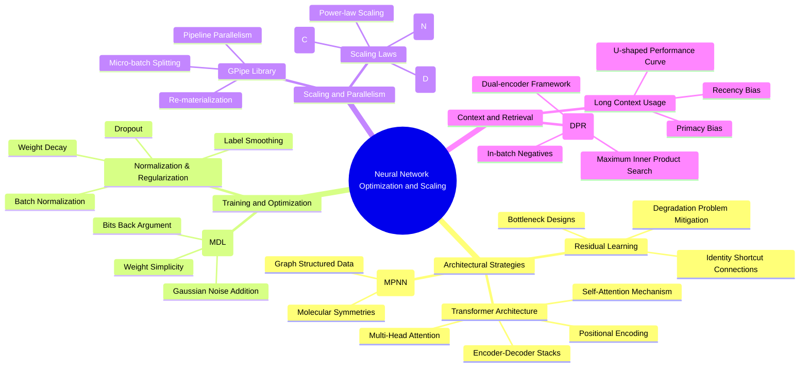

## 🧠 Primary Reflection

> [!abstract] Top-Down LLM-Wiki Overview
> This thought note acts as a top-down entry point generated via NotebookLM across all 33 foundational AI papers recommended by [Ilya Sutskever](https://en.wikipedia.org/wiki/Ilya_Sutskever). It synthesizes cross-cutting thematic clusters and maps out the architectural evolution of deep learning.

### Concept Relationship Map

### Major Thematic Clusters (from 33 Papers)

1. **Evolution of Sequential and Attentional Architectures**: Transition from RNNs/LSTMs to attention-based systems (Transformers) for processing sequences. -
2. **Theoretical Foundations of Learning as Data Compression**: Links between information theory, Kolmogorov complexity, and learning via the Minimum Description Length (MDL) principle. 
3. **Scaling Laws and Computational Efficiency**: Empirical power-law trends in model performance as model size, dataset size, and compute budget scale. 
4. **Relational and Structured Reasoning**: Architectural modules designed to model interactions between discrete entities (e.g., MPNNs, Relation Networks). 
5. **Augmented Information Access and Retrieval**: Endowing models with non-parametric memory (DPR, RAG) while managing long-context utilization challenges (U-shaped performance curves). - 3
6. **Hierarchical Feature Extraction in Computer Vision**: Progress in CNNs and management of high-level representations through Deep Residual Learning. 
7. **Philosophical and Formal Definitions of Intelligence**: Formalizing intelligence as an agent's ability to achieve goals in diverse environments, leading to the AIXI model. -2

### Key Architectural Shifts

The evolution of deep learning has been defined by two major architectural shifts designed to overcome training bottlenecks and sequential computation limits:

*   **Deep Residual Learning (ResNets):** Addressed the "degradation" problem where increasing depth led to higher training errors by reformulating layers to learn residual functions ($F(x) = H(x) - x$).
*   **The Transformer Model:** Replaced inherently sequential RNNs with Multi-Head Self-Attention, allowing models to draw global dependencies regardless of distance in the sequence and significantly increasing parallelization.

### Emerging Challenges: The "Lost in the Middle" Phenomenon

As language models have expanded their context windows, research uncovered that models do not use long contexts robustly. Performance follows a **U-shaped curve**, where accuracy is highest when relevant information is at the very beginning (**primacy bias**) or the very end (**recency bias**) of the context, degrading significantly when located in the middle.

### Actionable Insights for Research

1. **Prioritize Residual Connections in Deep Architectures:** To prevent performance degradation as networks scale in depth.
2. **Adopt Transformers for Sequence Tasks:** For modeling long-range dependencies or high parallelization.
3. **Implement DPR for High-Precision QA:** Moving beyond BM25 to Dense Passage Retrieval improves semantic matching.
4. **Optimize Prompt Information Placement:** Place critical information at the very beginning or end of prompts to mitigate the "Lost in the Middle" degradation.

## 🎯 Questions Upgraded from This Thought

<!-- Update when this Thought upgrades to a testable Question -->

- **Upgrade Date**: 
- **Question**: 
- **Rationale**: 
